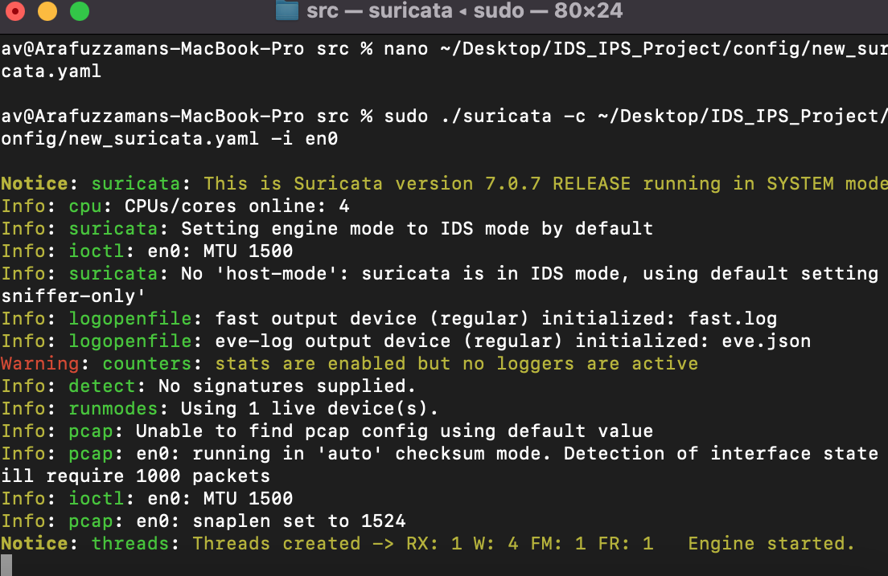

# Intrusion Detection/Prevention System (IDS/IPS) Project

## Overview
This project demonstrates the setup and configuration of an Intrusion Detection/Prevention System (IDS/IPS) using Suricata. The goal is to monitor network traffic for malicious activities and enhance the security posture of the environment.

## Prerequisites
- Suricata (version 7.0.7) was installed.
- Basic understanding of network protocols and cybersecurity principles.

## Installation
1. Downloaded the Suricata installation package (suricata-7.0.7.tar.gz).
2. Extracted the package and followed the installation instructions specific to the operating system.

## Configuration
- The configuration file is located in the `config` folder. 
- Modified the `suricata.yaml` file according to my network settings. 

### Key Configuration Snippet
```yaml
vars:
  address-groups:
    HOME_NET: "[192.168.1.0/24]"
    EXTERNAL_NET: "!$HOME_NET"

outputs:
  - fast:
      enabled: yes
      filename: fast.log
      append: yes
  - eve-log:
      enabled: yes
      filename: eve.json
      types:
        - alert
        - http
        - dns
        - tls
  - file-store:
      enabled: yes
      directory: "/Users/av/Desktop/IDS_IPS_Project/logs"
      filename: file-store.log
```

## Usage

### Started Suricata in IDS Mode
To start Suricata in IDS mode, ran the following command in my terminal:

```bash
sudo ./suricata -c ~/Desktop/IDS_IPS_Project/config/suricata.yaml -i en0
```
## Suricata Running in IDS Mode
Below is a screenshot showing Suricata running in IDS mode. 



**Note**: The warning about "counters: stats are enabled but no loggers are active" indicates that while Suricata can log alerts, additional configurations for logging statistics are not enabled. This does not affect the primary functionality of the IDS.

## Generated Network Traffic
Generated network traffic using tools like curl to visit various websites or run scans to trigger alerts. For example, I used:
```bash
curl http://testmynids.org/uid/index.html
```
## Alerts
Alerts generated during testing will be logged in eve.json and fast.log located in the logs folder.

## Example Alert
Here’s an example of an alert that might be logged:

```json
{
  "timestamp": "2024-10-30T02:53:28.803418-0400",
  "flow_id": 375194478544131,
  "in_iface": "en0",
  "event_type": "alert",
  "src_ip": "199.59.243.227",
  "src_port": 80,
  "dest_ip": "192.168.1.233",
  "dest_port": 50221,
  "proto": "TCP",
  "alert": {
    "action": "allowed",
    "gid": 1,
    "signature_id": 2221010,
    "rev": 1,
    "signature": "SURICATA HTTP unable to match response to request",
    "category": "Generic Protocol Command Decode",
    "severity": 3
  }
}
```
## Screenshot


## Conclusion
This project highlights the importance of IDS/IPS in protecting networks from potential threats. It showcases practical skills in configuring Suricata and generating network alerts.

## Author
Arafuzzaman Ovhe
Email: arafovhe@outlook.com
GitHub: ArAfs-bit
